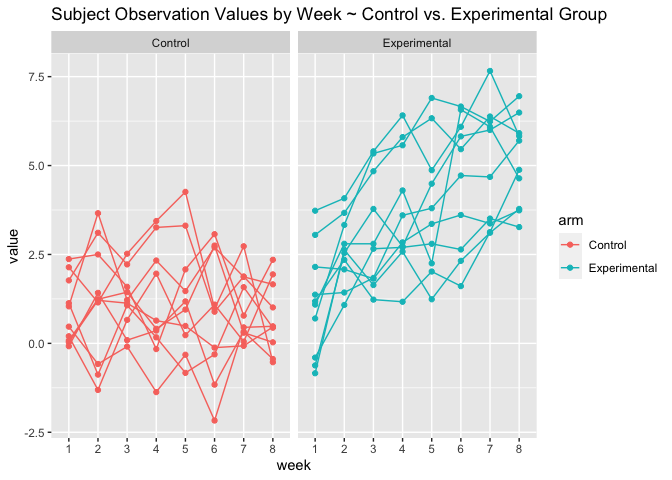
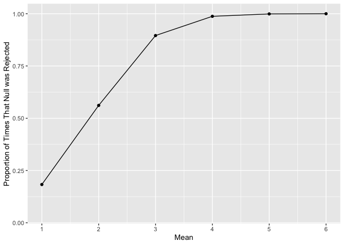
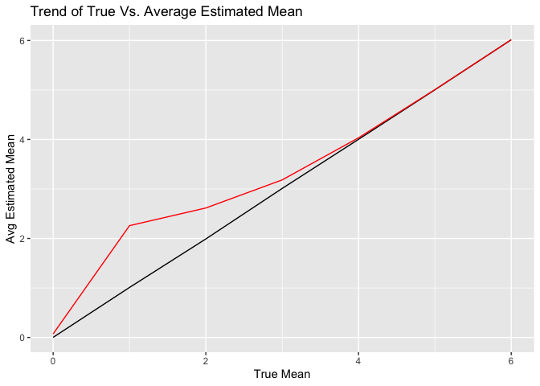

p8105_hw5_lel2176
================
2023-11-10

``` r
library(tidyverse)
```

    ## ── Attaching core tidyverse packages ──────────────────────── tidyverse 2.0.0 ──
    ## ✔ dplyr     1.1.3     ✔ readr     2.1.4
    ## ✔ forcats   1.0.0     ✔ stringr   1.5.0
    ## ✔ ggplot2   3.4.3     ✔ tibble    3.2.1
    ## ✔ lubridate 1.9.2     ✔ tidyr     1.3.0
    ## ✔ purrr     1.0.2     
    ## ── Conflicts ────────────────────────────────────────── tidyverse_conflicts() ──
    ## ✖ dplyr::filter() masks stats::filter()
    ## ✖ dplyr::lag()    masks stats::lag()
    ## ℹ Use the conflicted package (<http://conflicted.r-lib.org/>) to force all conflicts to become errors

``` r
library(purrr)
library(broom)
```

``` r
files = list.files(path = "data/data", pattern = ".csv", full.names = TRUE)

df = purrr::map(files, read_csv) |>  
  bind_rows() |> 
  mutate(arm = as.factor(if_else(row_number() %in% c(1:10), "Control", "Experimental")),
         ID = row_number()) |> 
  relocate(arm, ID, .before = "week_1") |> 
  pivot_longer(cols = week_1:week_8, names_to = "week", values_to = "value") |> 
  mutate(
    week = case_match(
      week, 
      "week_1" ~ "1",
      "week_2" ~ "2", 
      "week_3" ~ "3", 
      "week_4" ~ "4",
      "week_5" ~ "5", 
      "week_6" ~ "6",
      "week_7" ~ "7",
      "week_8" ~ "8"
    )
  )


df |>  
  knitr::kable()
```

| arm          |  ID | week | value |
|:-------------|----:|:-----|------:|
| Control      |   1 | 1    |  0.20 |
| Control      |   1 | 2    | -1.31 |
| Control      |   1 | 3    |  0.66 |
| Control      |   1 | 4    |  1.96 |
| Control      |   1 | 5    |  0.23 |
| Control      |   1 | 6    |  1.09 |
| Control      |   1 | 7    |  0.05 |
| Control      |   1 | 8    |  1.94 |
| Control      |   2 | 1    |  1.13 |
| Control      |   2 | 2    | -0.88 |
| Control      |   2 | 3    |  1.07 |
| Control      |   2 | 4    |  0.17 |
| Control      |   2 | 5    | -0.83 |
| Control      |   2 | 6    | -0.31 |
| Control      |   2 | 7    |  1.58 |
| Control      |   2 | 8    |  0.44 |
| Control      |   3 | 1    |  1.77 |
| Control      |   3 | 2    |  3.11 |
| Control      |   3 | 3    |  2.22 |
| Control      |   3 | 4    |  3.26 |
| Control      |   3 | 5    |  3.31 |
| Control      |   3 | 6    |  0.89 |
| Control      |   3 | 7    |  1.88 |
| Control      |   3 | 8    |  1.01 |
| Control      |   4 | 1    |  1.04 |
| Control      |   4 | 2    |  3.66 |
| Control      |   4 | 3    |  1.22 |
| Control      |   4 | 4    |  2.33 |
| Control      |   4 | 5    |  1.47 |
| Control      |   4 | 6    |  2.70 |
| Control      |   4 | 7    |  1.87 |
| Control      |   4 | 8    |  1.66 |
| Control      |   5 | 1    |  0.47 |
| Control      |   5 | 2    | -0.58 |
| Control      |   5 | 3    | -0.09 |
| Control      |   5 | 4    | -1.37 |
| Control      |   5 | 5    | -0.32 |
| Control      |   5 | 6    | -2.17 |
| Control      |   5 | 7    |  0.45 |
| Control      |   5 | 8    |  0.48 |
| Control      |   6 | 1    |  2.37 |
| Control      |   6 | 2    |  2.50 |
| Control      |   6 | 3    |  1.59 |
| Control      |   6 | 4    | -0.16 |
| Control      |   6 | 5    |  2.08 |
| Control      |   6 | 6    |  3.07 |
| Control      |   6 | 7    |  0.78 |
| Control      |   6 | 8    |  2.35 |
| Control      |   7 | 1    |  0.03 |
| Control      |   7 | 2    |  1.21 |
| Control      |   7 | 3    |  1.13 |
| Control      |   7 | 4    |  0.64 |
| Control      |   7 | 5    |  0.49 |
| Control      |   7 | 6    | -0.12 |
| Control      |   7 | 7    | -0.07 |
| Control      |   7 | 8    |  0.46 |
| Control      |   8 | 1    | -0.08 |
| Control      |   8 | 2    |  1.42 |
| Control      |   8 | 3    |  0.09 |
| Control      |   8 | 4    |  0.36 |
| Control      |   8 | 5    |  1.18 |
| Control      |   8 | 6    | -1.16 |
| Control      |   8 | 7    |  0.33 |
| Control      |   8 | 8    | -0.44 |
| Control      |   9 | 1    |  0.08 |
| Control      |   9 | 2    |  1.24 |
| Control      |   9 | 3    |  1.44 |
| Control      |   9 | 4    |  0.41 |
| Control      |   9 | 5    |  0.95 |
| Control      |   9 | 6    |  2.75 |
| Control      |   9 | 7    |  0.30 |
| Control      |   9 | 8    |  0.03 |
| Control      |  10 | 1    |  2.14 |
| Control      |  10 | 2    |  1.15 |
| Control      |  10 | 3    |  2.52 |
| Control      |  10 | 4    |  3.44 |
| Control      |  10 | 5    |  4.26 |
| Control      |  10 | 6    |  0.97 |
| Control      |  10 | 7    |  2.73 |
| Control      |  10 | 8    | -0.53 |
| Experimental |  11 | 1    |  3.05 |
| Experimental |  11 | 2    |  3.67 |
| Experimental |  11 | 3    |  4.84 |
| Experimental |  11 | 4    |  5.80 |
| Experimental |  11 | 5    |  6.33 |
| Experimental |  11 | 6    |  5.46 |
| Experimental |  11 | 7    |  6.38 |
| Experimental |  11 | 8    |  5.91 |
| Experimental |  12 | 1    | -0.84 |
| Experimental |  12 | 2    |  2.63 |
| Experimental |  12 | 3    |  1.64 |
| Experimental |  12 | 4    |  2.58 |
| Experimental |  12 | 5    |  1.24 |
| Experimental |  12 | 6    |  2.32 |
| Experimental |  12 | 7    |  3.11 |
| Experimental |  12 | 8    |  3.78 |
| Experimental |  13 | 1    |  2.15 |
| Experimental |  13 | 2    |  2.08 |
| Experimental |  13 | 3    |  1.82 |
| Experimental |  13 | 4    |  2.84 |
| Experimental |  13 | 5    |  3.36 |
| Experimental |  13 | 6    |  3.61 |
| Experimental |  13 | 7    |  3.37 |
| Experimental |  13 | 8    |  3.74 |
| Experimental |  14 | 1    | -0.62 |
| Experimental |  14 | 2    |  2.54 |
| Experimental |  14 | 3    |  3.78 |
| Experimental |  14 | 4    |  2.73 |
| Experimental |  14 | 5    |  4.49 |
| Experimental |  14 | 6    |  5.82 |
| Experimental |  14 | 7    |  6.00 |
| Experimental |  14 | 8    |  6.49 |
| Experimental |  15 | 1    |  0.70 |
| Experimental |  15 | 2    |  3.33 |
| Experimental |  15 | 3    |  5.34 |
| Experimental |  15 | 4    |  5.57 |
| Experimental |  15 | 5    |  6.90 |
| Experimental |  15 | 6    |  6.66 |
| Experimental |  15 | 7    |  6.24 |
| Experimental |  15 | 8    |  6.95 |
| Experimental |  16 | 1    |  3.73 |
| Experimental |  16 | 2    |  4.08 |
| Experimental |  16 | 3    |  5.40 |
| Experimental |  16 | 4    |  6.41 |
| Experimental |  16 | 5    |  4.87 |
| Experimental |  16 | 6    |  6.09 |
| Experimental |  16 | 7    |  7.66 |
| Experimental |  16 | 8    |  5.83 |
| Experimental |  17 | 1    |  1.18 |
| Experimental |  17 | 2    |  2.35 |
| Experimental |  17 | 3    |  1.23 |
| Experimental |  17 | 4    |  1.17 |
| Experimental |  17 | 5    |  2.02 |
| Experimental |  17 | 6    |  1.61 |
| Experimental |  17 | 7    |  3.13 |
| Experimental |  17 | 8    |  4.88 |
| Experimental |  18 | 1    |  1.37 |
| Experimental |  18 | 2    |  1.43 |
| Experimental |  18 | 3    |  1.84 |
| Experimental |  18 | 4    |  3.60 |
| Experimental |  18 | 5    |  3.80 |
| Experimental |  18 | 6    |  4.72 |
| Experimental |  18 | 7    |  4.68 |
| Experimental |  18 | 8    |  5.70 |
| Experimental |  19 | 1    | -0.40 |
| Experimental |  19 | 2    |  1.08 |
| Experimental |  19 | 3    |  2.66 |
| Experimental |  19 | 4    |  2.70 |
| Experimental |  19 | 5    |  2.80 |
| Experimental |  19 | 6    |  2.64 |
| Experimental |  19 | 7    |  3.51 |
| Experimental |  19 | 8    |  3.27 |
| Experimental |  20 | 1    |  1.09 |
| Experimental |  20 | 2    |  2.80 |
| Experimental |  20 | 3    |  2.80 |
| Experimental |  20 | 4    |  4.30 |
| Experimental |  20 | 5    |  2.25 |
| Experimental |  20 | 6    |  6.57 |
| Experimental |  20 | 7    |  6.09 |
| Experimental |  20 | 8    |  4.64 |

``` r
df |>
  ggplot(aes(x = week, y = value, color = arm, group = ID)) +
  geom_line() +
  geom_point() +
  labs(title = "Subject Observation Values by Week ~ Control vs. Experimental Group") +
  facet_wrap(~arm)
```

<!-- -->

The experimental arm of the trial has higher average and overall values
of the observations than the control arm of the trial. The trend of the
experimental group is slightly increasing and the trend of the control
group is very slightly decreasing.

``` r
test = function(mu) {
  
  data = tibble(x = rnorm(n = 30, mean = mu, sd = 5))
  
  result = data |> 
    t.test() |> 
    broom::tidy() |> 
    select(estimate, p.value) 
    
    result
}

output = expand_grid(
  df = c(0, 1, 2, 3, 4, 5, 6), 
  iteration = 1:5000
) |> 
  mutate(
    results = map(df, test)
  ) |> 
  unnest(results)
```

``` r
output |> 
  group_by(df) |>  
  summarize(prop_rej = sum(p.value < 0.05)/5000) |>  
  ggplot(aes(x = df, y = prop_rej)) +
  scale_x_continuous(limits = c(1,6), breaks = seq(1,6,1)) + 
  geom_point() + 
  geom_path() +
  labs(x = "Mean", y = "Proportion of Times That Null was Rejected")
```

    ## Warning: Removed 1 rows containing missing values (`geom_point()`).

    ## Warning: Removed 1 row containing missing values (`geom_path()`).

<!-- -->

As the true mean increases, the proportion of times that the null was
rejected also increases. However the curve flattens out as it reaches 1
and does not exceed this value.

``` r
true =
  output |> 
  group_by(df) |> 
  summarize(mean = mean(estimate))

reject = 
  output |> 
  filter(p.value < 0.05) |> 
  group_by(df) |> 
  summarize(mean = mean(estimate))
  

avg_est = ggplot(true, aes(x = df, y = mean)) +
  geom_line() +
  geom_line(data = reject, color = "red") +
  labs(x = "True Mean", y = "Avg Estimated Mean", title = "Trend of True Vs. Average Estimated Mean")

avg_est
```

<!-- -->

In this graph, we see that the average estimated mean differs from the
true mean for values 0-4. However, from values 4 and above, the
estimated mean is equivalent to the true mean. This is seen on the graph
by the red line representing the average estimated mean, and the black
line representing the true mean. The two lines follow the same trend
from values 4 and above.
